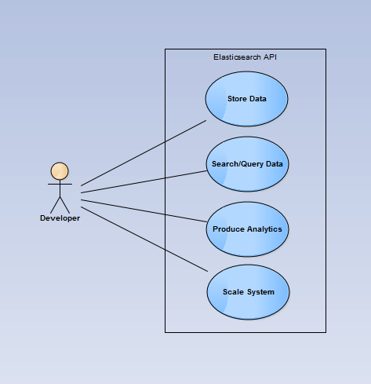
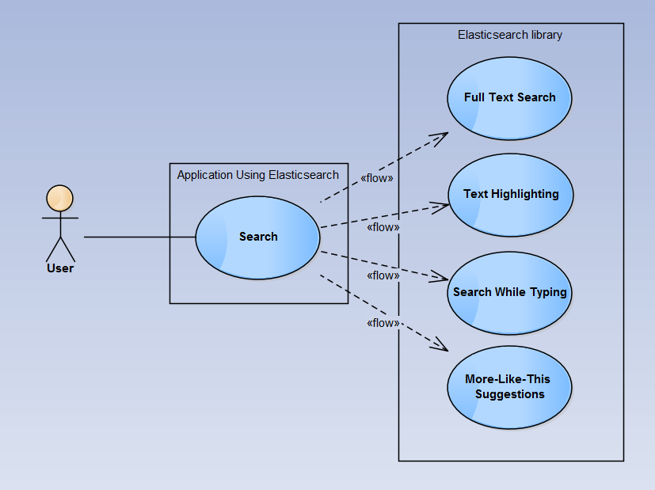
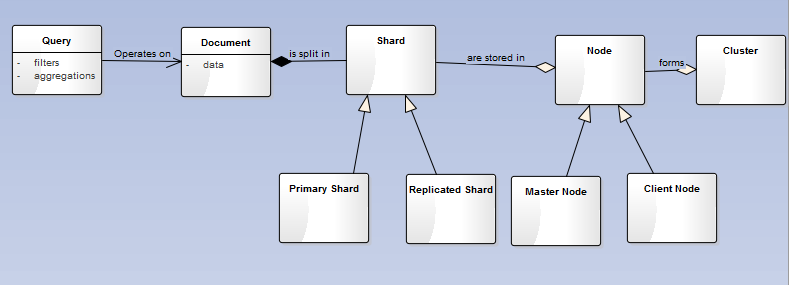

ESOF - Second Report
====================
Elasticsearch is a distributed search engine and data storage system based on Apache Lucene.

Its nature as a distributed search engine and data storage system requires as a main feature that the various shards that comprise the document be distributed between various machines or nodes. Its touted high availability necessitates that the various shards be constantly communicating with each other, ready to appropriately respond to a variety of failures in the different nodes.

Both the growing need for high throughput and the need for reliability are fulfilled by the redundancy in the replicated shards housed in the nodes.

Functional Requirements:
* Data Storage - the system must be able to store the information to be retrieved and searched
* Distributed - storing the various documents comprising the data in multiple machines offers a wide variety of benefits, the system must be able to manage the various nodes
* Analytics - the data must queryable for aggregations and statistics 
* Full Text Search - the ability for fuzzy/exact matching on both partial and entire data fields 
* Able to handle human language - consideration of the syntax/semantics of natural language provides more meaningful and useful results
* Able to handle geolocation data - many applications use and store geolocation data, to be able to efficiently handle it out-of-the-box is highly valued
* Highlighted Search - many applications require that the segments of the documents that matched a search be highlighted for the user
* *Search-as-you-type* functionality - faster and more interactive searches need the searches 
* *Did-you-mean* and *More-like-this* suggestions - these kinds of suggestions enable the users of an application to other data that they might be interested in
* RESTful API - a familiar and cross-language API allows for developers to quickly and easily start developing their applications
* Discovery - connected nodes should be able to automatically discover eachother

Non-Functional Requirements
* High Availability - the system must endure the inevitable failures in the potentially many nodes that host the data
* High Throughput/Real Time Performance - fast response times and overall efficiency are highly valued, especially in highly saturated services/applications
* High Flexibility in queries/data - the schema-less, document-oriented model as well as the querying system must be flexible enough to effortlessly model any domain 
* Reliability - the data in the system must be kept through failures in the nodes that host the data
* Developer Friendliness - developers unfamiliar with distributed NoSQL systems or search engines such as Lucene must be able to quickly get up and running
* High Horizontal Scalability - the system must elegantly support the heavy load inherent in large-scale applications involving massive amounts of information

Validation of Requirements
--------------------------
Since its inception, the project has admirably met its myriad requirements, which have been repeatedly tested and verified by its many users, the principal stakeholders in the project, both in production and in its testing suite.

Use Cases
---------
->  <-

->  <-

Domain Model
------------

